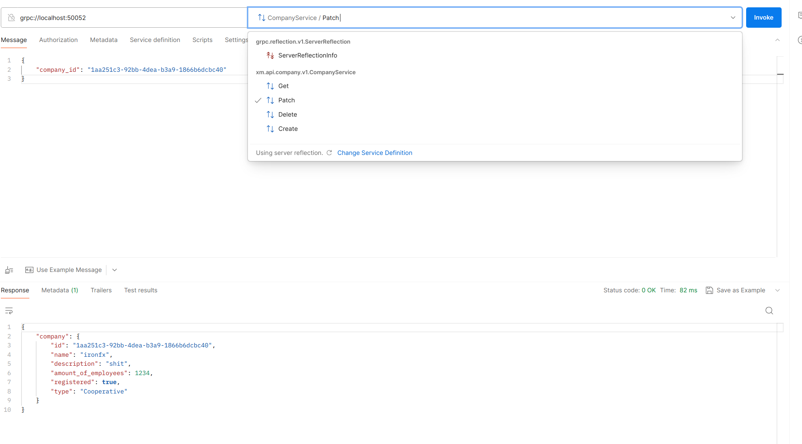

# xm-test-assignment

## Description
Company service is responsible for CRUD operations on companies. It can create, patch, get and delete company. Also notification logic is implemented which publishes corresponding events to kafka topics (except Get operation). PostgreSQL database is used as a storage. Simple authorization mechanism is implemented to allow Create/Patch/Delete operation be executed for users with particular role. Company service exposes gRPC endpoints.

## Build & Run
1. Run `make start` which
    - Initilizes DB (*Workaround to fix issue with DB connecton. The problem was in connection to DB when application container starts right after DB container and cannot connect. I noticed it right before the deadline and had no time to fix it properly.*) Also it creates `.docker` directory which used as a volume for DB container:
        ```
        volumes:
            - ./.docker/postgresql/loms/data:/var/lib/postgresql/data
        ```
    - Builds application. It installs required dependencies (sqlc for queries, goose for migrations, proto generators, etc.), generates proto, runs sqlc generator of entities, builds application.
    - Runs all containers via docker-compose. It runs kafka clusters, zookeeper, postgresql, kafka-ui and the application itself.
    - Runs DB migrations (uses `goose` for migrations)
1. Run `make run` to stop application

#### *Potential improvements*
* Generate dependencies (proto files, SQL queries) and build application in Docker

## Testing via Postman
Postman does not provide gRPC collections export functionality to users. To test via Postman do next steps:

1. Add gRPC request
1. Use "grpc://localhost:50052" as host address
1. Disable TLS
1. Use server reflection to fetch protocol (if it is not working, import direct [service proto](/company/api/company/v1/company.proto) and [dependencies](/company/vendor-proto/validate/validate.proto))
1. Click "Use Example Message" to generate proto message
1. In Authorization section add Bearer [jwt token](postman/jwt))




## Auth
Authorization middleware is implemented to handle authorization for Create, Patch and Delete endpoints. JWT token should contain `admin` role. Please, use attached [jwt token](postman/jwt) for authentication/authorization.

## Unit & Integration testing
I realize how important tests are. At my work I usually write Unit and Integration tests which cover different scenarios. Unfortunatelly, I had not time for them in this assignment.

## Events
Kafka is used as a message broker. Published events you can find in kafka-ui (use `http://localhost:8084/`) and configure cluster by adding bootstap servers:
* `LISTNER_INT://kafka-broker-1` with port 9091
* `LISTNER_INT://kafka-broker-2` with port 9092
* `LISTNER_INT://kafka-broker-3` with port 9093

## Database
After initializing DB you can connect via `jdbc:postgresql://localhost:5433/company` with credentals `postgres/password`

## Linter
Added to Makefile
