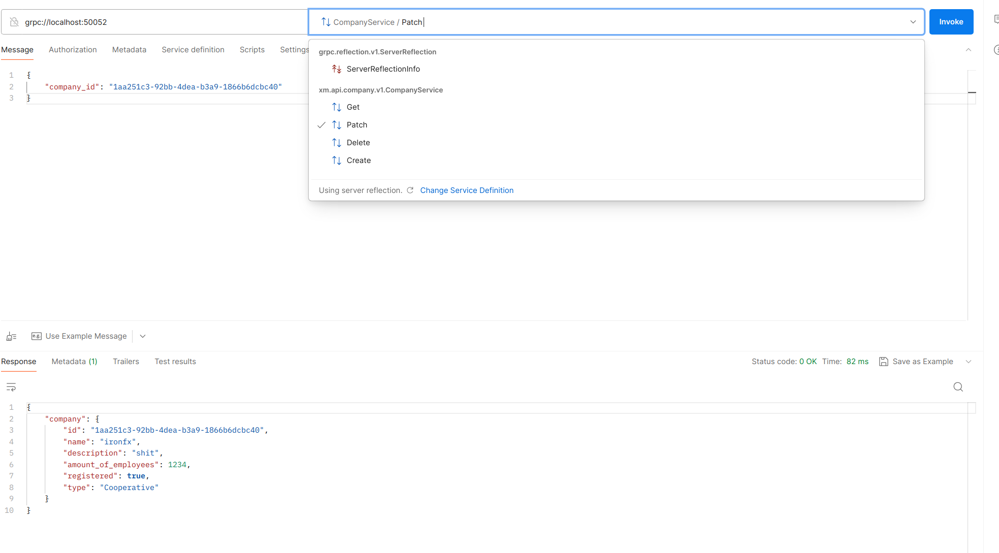
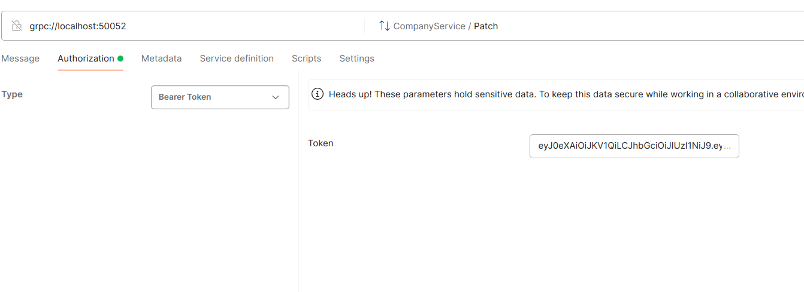

# Testing via Postman

Postman does not provide gRPC collections export functionality to users. To test via Postman do next steps:

1. Add gRPC request
1. Use "grpc://localhost:50052" as host address
1. Disable TLS
1. Use server reflection to fetch protocol (if it is not working, import direct [service proto](../company/api/company/v1/company.proto) and [dependencies](../company/vendor-proto/validate/validate.proto))
1. Click "Use Example Message" to generate proto message
1. In Authorization section add Bearer [jwt token](jwt))

